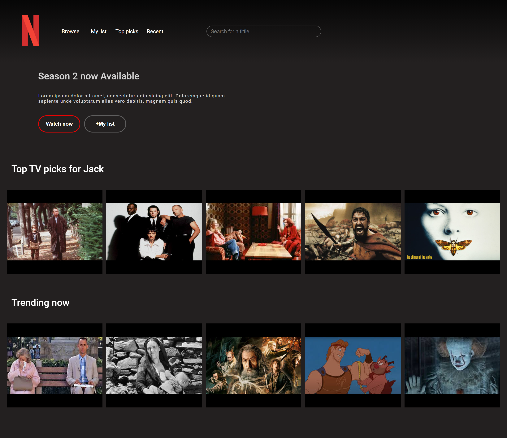

# Página_Netflix 
##### Basado en https://codepen.io/studiojvla/pen/zBQAWo de Jack Oliver

Proyecto hecho en React.
##### Para correr el proyecto: npm run start
El proyecto se monta en http://localhost:3000 y consume datos del archivo db.json

